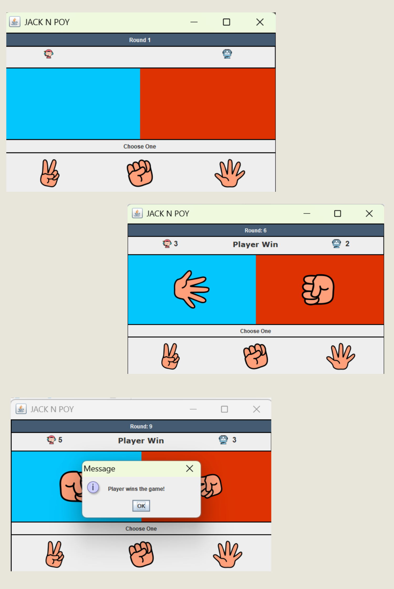

# Jack & Poy

## Overview 📌
"Jack & Poy Raise to 5" is a digital twist on the classic rock-paper-scissors game. Compete against the computer with the goal of reaching 5 wins first. Choose Rock, Paper, or Scissors and see who comes out on top in this fast-paced game!


## Features 📌
- **Multiplayer**: Play against the computer in a fast-paced 1v1 format.
- **Dynamic Round Tracking**: The game displays the current round and updates as players choose their actions.
- **Scoreboard**: Keeps track of wins for both the player and the computer.
- **Game End Logic**: The game concludes when either the player or computer reaches 5 points.

## Tech Stack 📌
- **GUI**: Java Swing
- **Game Logic**: Java

## How to Run 📌

### 1. Clone the Repository

To run this project locally, you first need to clone the repository from GitHub. Here’s how you can do it:

- **Step 1**: Open your terminal (or Git Bash for Windows).
- **Step 2**: Navigate to the directory where you want to store the project.
- **Step 3**: Run the following `git clone` command:

   ```bash
        git clone https://github.com/Ejxzdevs/Jack-N-Poy.git
   
        cd Jack-N-Poy/src

        javac --release 8 Main.java
        
        java Main

